GITHUB LINK - https://github.com/coderkarthiko/ml-project/edit/master

# tl;dr

#### What - 
This project is basically a machine learning library I built (dl2.py, see below) and a demonstration of its capabilities. I have implemented machine learning algorithms like backpropagation, gradient descent, regression, multi-layer perceptrons and convolutional neural networks (CNNs) and generative adversarial networks (GANs) using my library. 

#### Why - 
TensorFlow and PyTorch are widely used machine learning libraries. One doesn't even need to fully understand how neural networks work in order to use TensorFlow or Pytorch (they abstract away most of the workings of neural nets and still allow one to make some really cool things). But I didn't like how it abstracted away the nitty-gritty details of training neural networks. I wanted to REALLY understand how they worked. I wanted to understand the math and the techniques utilized to train neural networks. The best way to understand something is to create it - so I built a neural network library using NumPy in Python. It's not at all as efficient as the libraries I've mentioned before but it gets the job done. This is the project I did after I finished finishing MIT 6.S191 (Introduction to Deep Learning) online lecture series. 

# dl.py - a small neural network library
dl is a small library I made to understand how neural networks and gradient descent optimizers work. It's quite simple and doesn't support CNNs. I have implemented the standard backpropagation algorithm (shown below). Gradient descent optimizers like SGD, Momentum, Adam, RMSprop and Adagrad can be used for training. 

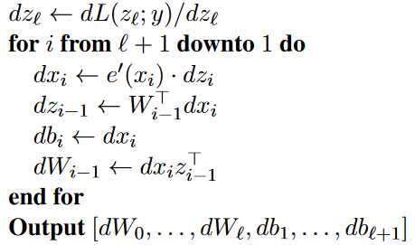

# dl2.py - an even better neural network library
dl2.py is a much better version of dl.py but it's still quite simple. It's a neural network library which supports multi-layer perceptrons (the vanilla neural networks), convolutional neural networks (neural nets used for visual processing) and gradient descent optimizers. I've implemented all matrix operations (forward and backward pass in a neural net) using NumPy. We can implement almost any ML algorithm using dl2.py. 

#### Things I've learnt and challenges I faced -
1. In order to understand neural networks I had to learn multivariable calculus and some linear algebra - ML involves convex optimization and a whole LOT of matrices...I realized that "learning" in "machine learning" simply reduces to optimizing an objective function. At first, my library was very simple. But overtime, I've added more things to it as I learnt new things.

2. My library was very slow and I wanted to see how well it performed at classifying images in the cifar10 dataset (a dataset of 60000 images) but it was VERY slow. Then I discovered Numba, which sped up NumPy. It improved the speed of training neural nets by an order of magnitude! I then implemented LeNet5 (one of the first neural nets used for handwritten character recognition) using dl2 to classify images from the cifar10 dataset (see last section) and it achieved an accuracy of 60 %. 
 
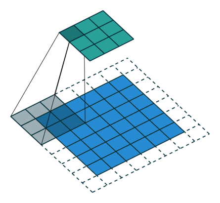

3. Convolutional neural networks are simply sparsely connected multi-layer perceptrons. If convolution layers are fully-connected we will be able to learn more features but the number of operations to get through a single convolution layer will explode. Once I understood how CNNs worked, I benchmarked the performace of the same CNN architecture with different optimizers (see CNN-MLP-benchmarks-dl2.ipynb). 

4. Implementing batch normalization - I understood how the forward pass worked (you normalize, scale and then shift) but I only later understood the derivation of the backward pass after working out the gradient for small layers and going through some blogposts. Below is the batch-norm computational graph. It's very easy to add whatever layers (like batch-norm) we want using ML libraries and make all kinds of neural net architectures. Somehow, these libraries seemed to magically compute gradients and we arrive at the perfect model for our training data. I really wanted to understand how they did it so effectively and I ended up implementing it myself. 

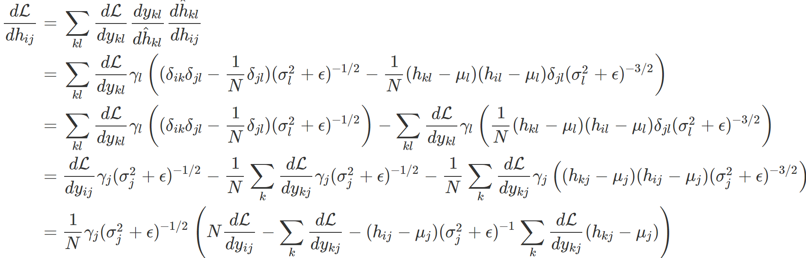

5. Understanding how GANs worked - GANs are probably one of the coolest things in machine learning (though they were invented all the way back in the AI stone age of 2014). They are the same neural net architectures used to make deepfakes and realistic artworks. I've implemented a GAN using TensorFlow (see GANtf.ipynb) and demonstration the training process of a GAN using dl2 (see GAT-dl2.ipynb).

# demo.ipynb - how dl2 works

#### Linear regression using dl2 -

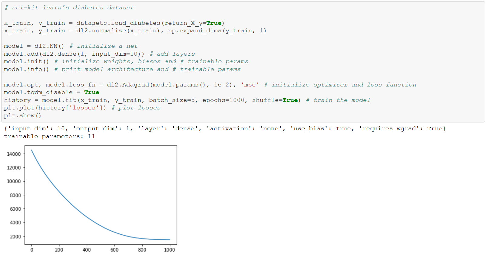

#### Logistic regression using dl2 -

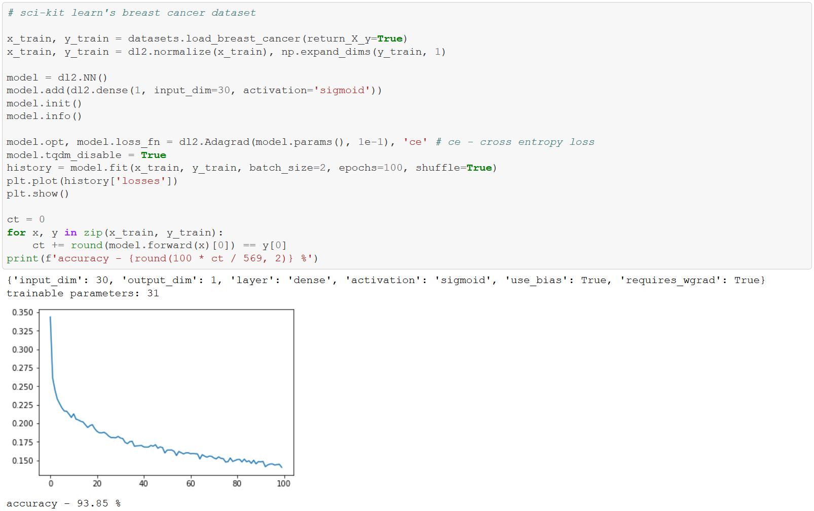

#### Polynomial regression using dl2 - 
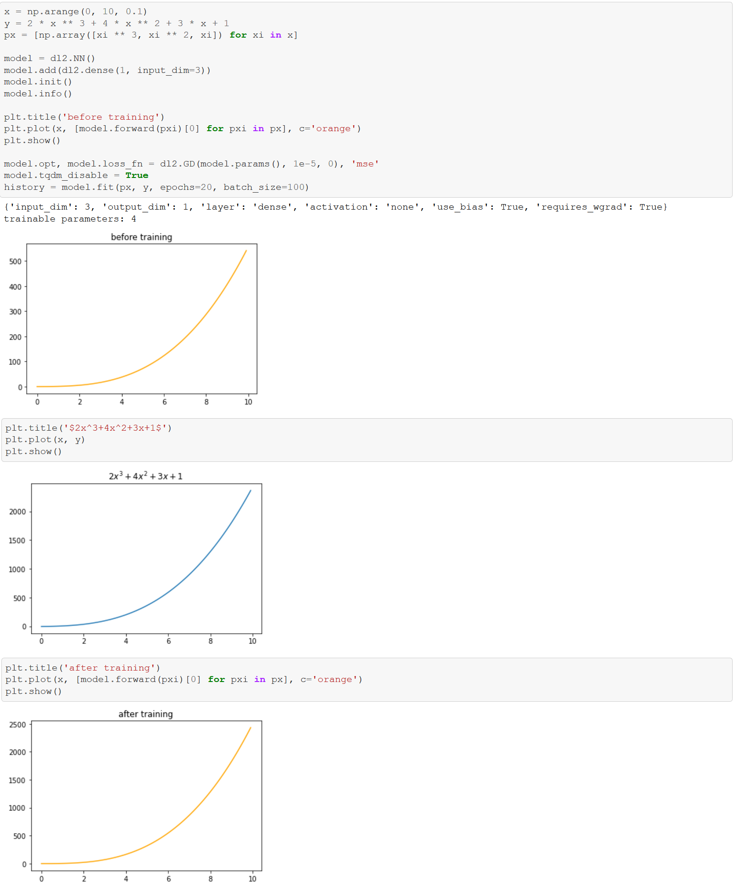

#### Implementing gradient descent optimizers using dl2 -

In TensorFlow, we can simply do opt = optimizers.Adam(...). Here, each optimizer is a class and we store the gradient and the updated parameters. Calling the step() method updates the parameters (which is done differently for every optimizer) and returns them. For a neural network, the parameters that we pass into the optimizer are the weights and biases of the network. We can use the optimizer class to learn any set of parameters (of arbitrary shape). The parameters have to be NumPy arrays. 

Below, we have a function of the form f(x) = N1(p(x) + **w**N2(x)) where p is a polynomial and N1 and N2 are neural networks and **w** is parameter. We compute the gradient of the loss function w.r.t to all the parameters of f and do gradient descent. The backward method returns the gradient of the loss function w.r.t to weights, biases and the input layer (the last is required for implementing GANs).  

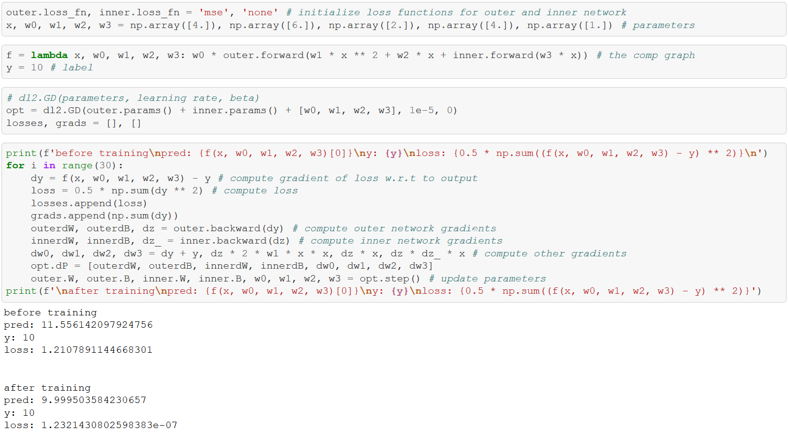

# UAT-dl2.ipynb - Universal Approximation Theorem

NNs are universal function approximators.

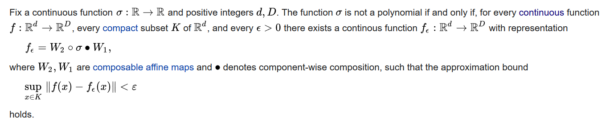

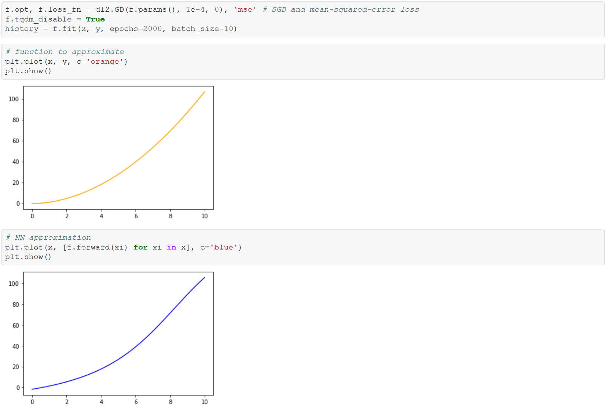

# GATES-dl.ipynb - modelling logic gates using neural networks
A classic problem in machine learning is using a neural network to model XOR. XOR is not a linearly separable function - and neural networks are good at approximating non-linear transformations. Logic gates have binary inputs but neural networks can have real inputs. So not only can we input 0 and 1, but all pairs of numbers in the range [0, 1] (with finite step size - say, 0.01). The contour plots of the corresponding outputs are shown below. Black regions and beyond => 1 and yellow regions and beyond => 0. In the plots, we can clearly see boundaries (black -> yellow) where the output jumps from 1 to 0 and 0 to 1.

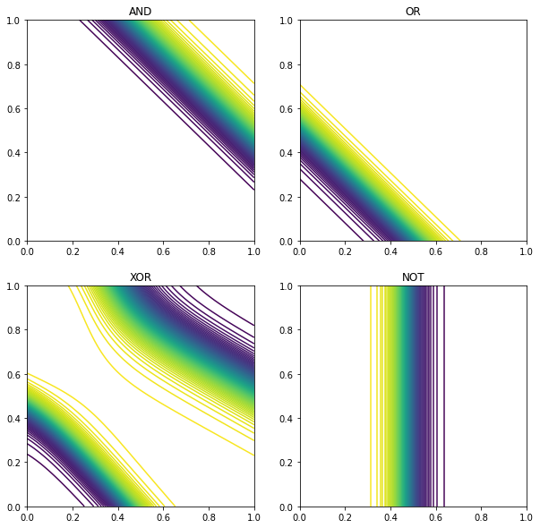

# GANs
Generative Adversarial Networks belong to a class of machine learning models called generative models. Generative models are used to learn data distributions using unsupervised learning. GANs were introduced in 2014 by Goodfellow et al. GANs can be used to do some really cool things - they can be used to [make art](https://heartbeat.fritz.ai/artificial-art-how-gans-are-making-machines-creative-b99105627198), [make life-like human faces](https://www.whichfaceisreal.com/), [make life-like human figures and models](https://rosebud.ai/) and even [learn the rules of a video game and recreate it](https://blogs.nvidia.com/blog/2020/05/22/gamegan-research-pacman-anniversary/) by using pixel information alone! 

#### Gradient flow for a simple GAN -

# GAN-tf.ipynb
My implementation of a GAN trained using TensorFlow and the MNIST data set. 

#### Evolution through epochs -

# GAT-dl2.ipynb
My implementation of the GAN training algorithm using dl2. 

#### The GAN training algorithm from the original paper -

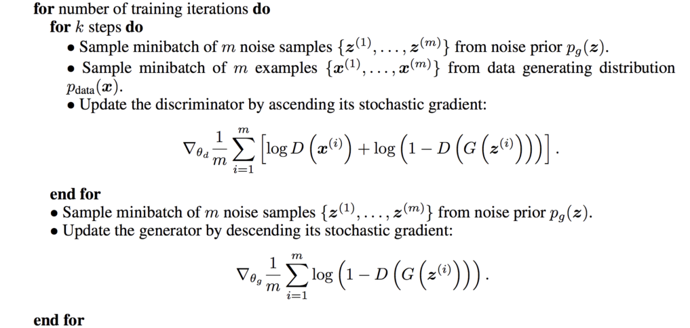

# CNN-MLP-benchmarks-dl2.ipynb
CNN and MLP classifiers using dl2. Here, I compare the accuracies of various gradient descent optimizers (SGD, Momentum, RMSprop, Adam and Adagrad).

#### Kernels -
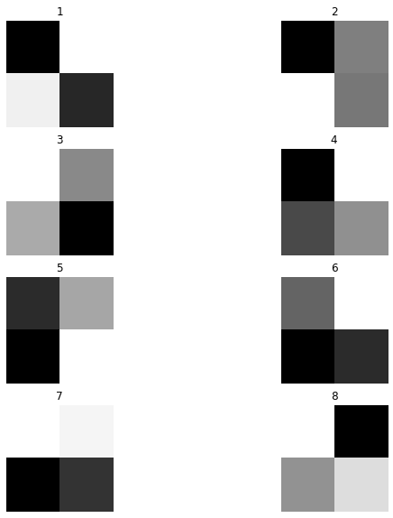

#### Weights -
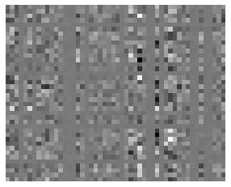

#### Different optimizers reach a local minima at different rates -

# LENET5-cifar10-dl2.ipynb
LeNet-5 trained on the cifar10 dataset. There are 10 classes and 60000 32x32x3 RGB images. I got a classification accuracy of about 60% after an hour and a half of training. We can get significantly better results using TensorFlow (94% accuracy in 2 minutes is possible with Google Colab’s TPUv2). 

#### The LeNet-5 CNN architecture -

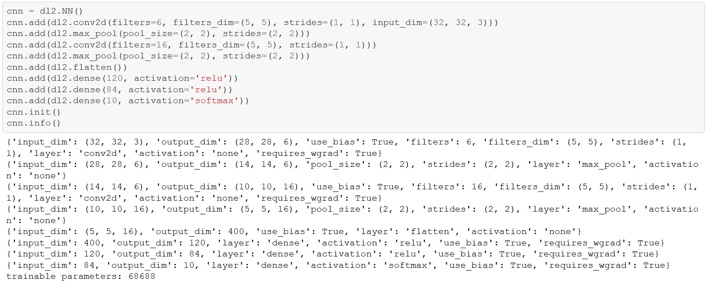

#### Some images from the cifar10 dataset -

#### Loss landscape of ResNet-10 trained on cifar10 -

# References
1. [neuralnetworksanddeeplearning.com](neuralnetworksanddeeplearning.com)
2. [MIT 6.S191: Introduction to Deep Learning](http://introtodeeplearning.com/)
3. [Stanford CS231n: Convolutional Neural Networks](http://cs231n.stanford.edu/)
4. [Generative Adversarial Networks](https://arxiv.org/abs/1406.2661)
6. [Why Momentum Really Works](https://distill.pub/2017/momentum/)
7. [An Overview of Gradient Descent Optimizers](https://ruder.io/optimizing-gradient-descent/)
8. [Understanding Convolutions](https://colah.github.io/posts/2014-07-Understanding-Convolutions/)
9. [Calculus on Computational Graphs](https://colah.github.io/posts/2015-08-Backprop/)
11. [Automatic Reverse-Mode Differentiation](http://www.cs.cmu.edu/~wcohen/10-605/notes/autodiff.pdf)
12. [Universal Approximation Theorem](https://en.wikipedia.org/wiki/Universal_approximation_theorem#:~:text=In%20the%20mathematical%20theory%20of,given%20function%20space%20of%20interest.)
13. [Batch Normalization: Accelerating Deep Network Training by Reducing Internal Covariate Shift](https://arxiv.org/abs/1502.03167)
14. [Batch Normalization Gradient Flow](http://cthorey.github.io./backpropagation/)
